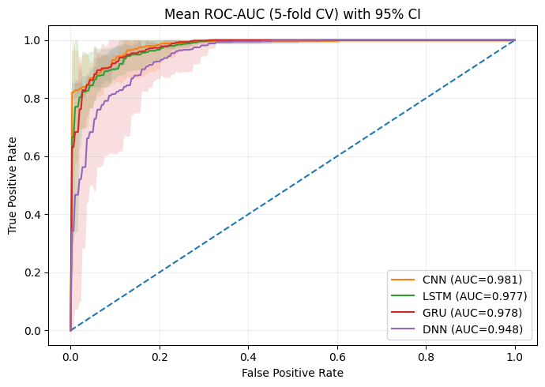
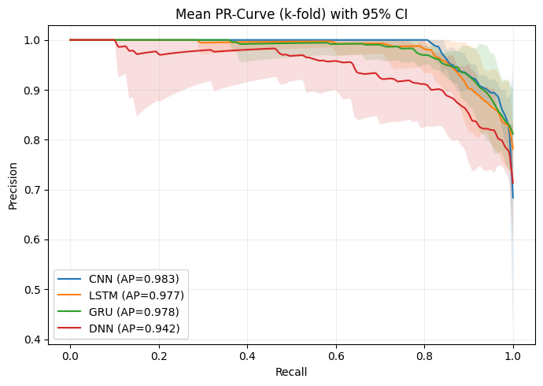
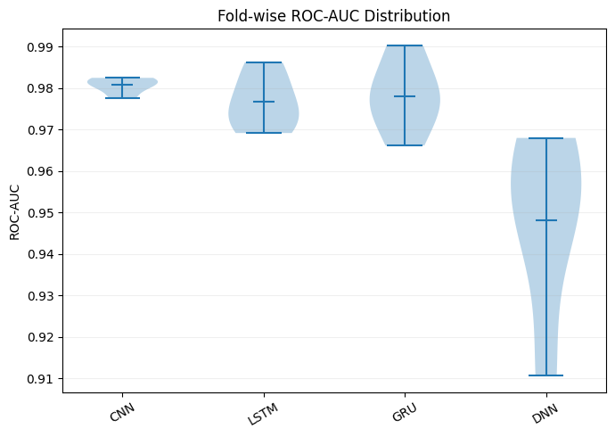
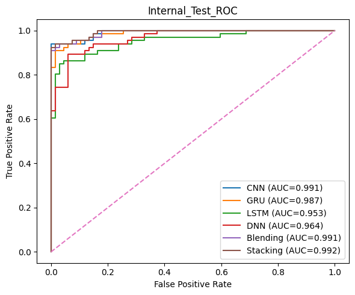
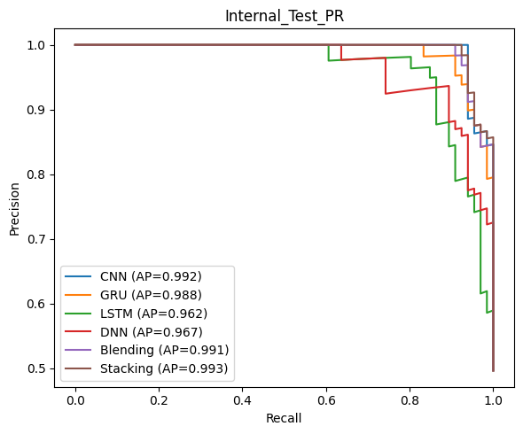

# DELF-hm5C-RNA

**DELF-hm5C-RNA** is a deep ensemble learning workflow for RNA 5-hydroxymethylcytosine (5hmC) site prediction. The simplified notebook in this repository runs the pipeline from library imports to internal independent evaluation using pre-extracted benchmark features and trained deep base learners.

The workflow uses four deep-learning base models:

- Convolutional Neural Network (CNN)
- Gated Recurrent Unit (GRU)
- Long Short-Term Memory network (LSTM)
- Deep Neural Network (DNN)

The predicted probabilities from these base learners are combined using two ensemble strategies:

- **Blending**, where a separate blend subset is used to train the Logistic Regression meta-learner.
- **Stacking**, where 5-fold out-of-fold (OOF) predictions are used to train the Logistic Regression meta-learner.

---

## Repository contents

The repository includes the notebook and supporting compressed files:

```text
DELF-hm5C-RNA/
│
├── hm5c-stack-blend-dl.ipynb
├── Datasets.zip
├── hm5c_benchmark_features.zip
├── base_models_trained.zip
└── README.md
```

### File descriptions

| File | Description |
|---|---|
| `hm5c-stack-blend-dl.ipynb` | Main simplified execution notebook with explanatory Markdown and comments. |
| `Datasets.zip` | Sequence-level datasets used in the study. These are useful for reference, reproducibility, or future feature extraction. |
| `hm5c_benchmark_features.zip` | Pre-extracted benchmark feature vectors required by the notebook. The notebook expects a CSV file containing 561-dimensional feature vectors and a binary label column. |
| `base_models_trained.zip` | Trained base model files used to quickly generate predictions without retraining all deep models from scratch. |

---

## Main notebook workflow

The notebook is organized into the following major sections:

1. Import libraries and set random seeds.
2. Define evaluation metrics and plotting utilities.
3. Define attention pooling, group-wise projection, and deep base learners.
4. Load the encoded benchmark feature dataset.
5. Define descriptor groups and preprocessing helpers.
6. Split the benchmark data into training and internal independent test sets.
7. Run the blending ensemble.
8. Run 5-fold OOF stacking.
9. Generate base-learner CV summaries and statistical comparison tables.
10. Evaluate CNN, GRU, LSTM, DNN, blending, and stacking on the internal independent test set.
11. Plot ROC and precision-recall curves.

---

## Required input feature format

The simplified notebook does **not** extract features directly from raw RNA sequences. It expects already extracted feature vectors.

The main feature CSV should contain:

- feature columns for the following descriptor groups:
  - `SEQMAT`
  - `LRIM`
  - `ILRIM`
  - `NoDV`
  - `APRIV`
  - `IAPRIV`
  - `PSTNPV`
- a binary target column named:

```text
label
```

If your label column has a different name, update this line in the notebook:

```python
LABEL_COL = "label"
```

If your CSV contains an identifier column named `name`, the notebook automatically removes it from the feature matrix because it is not used as a predictive feature.

---

## Environment requirements

The notebook was designed for Python-based notebook environments such as Kaggle, Google Colab, Hugging Face, or a local Jupyter environment.

Recommended Python packages:

```text
numpy
pandas
matplotlib
scikit-learn
scipy
statsmodels
tensorflow
joblib
```

A GPU is recommended for retraining the base learners. For loading already trained models and running evaluation, CPU can also work, although it may be slower.

---

## Installation

Create a fresh environment and install the required packages:

```bash
pip install numpy pandas matplotlib scikit-learn scipy statsmodels tensorflow joblib
```

For Google Colab or Kaggle, most packages are already available. Install only missing packages when required.

---

## Preparing the data and trained models

Before running the notebook, extract the compressed files.

### Option 1: Kaggle

Upload the repository files or zipped files as Kaggle input datasets. Then extract them into `/kaggle/working/`:

```python
import zipfile, os

os.makedirs("/kaggle/working/hm5c_benchmark_features", exist_ok=True)
os.makedirs("/kaggle/working/base_models_trained", exist_ok=True)
os.makedirs("/kaggle/working/Datasets", exist_ok=True)

with zipfile.ZipFile("/kaggle/input/YOUR_DATASET_NAME/hm5c_benchmark_features.zip", "r") as z:
    z.extractall("/kaggle/working/hm5c_benchmark_features")

with zipfile.ZipFile("/kaggle/input/YOUR_DATASET_NAME/base_models_trained.zip", "r") as z:
    z.extractall("/kaggle/working/base_models_trained")

with zipfile.ZipFile("/kaggle/input/YOUR_DATASET_NAME/Datasets.zip", "r") as z:
    z.extractall("/kaggle/working/Datasets")
```

Then update the paths in the notebook:

```python
CSV_PATH = "/kaggle/working/hm5c_benchmark_features/main_dataset_fvs.csv"
MODEL_DIR = "/kaggle/working/base_models_trained"
```

For loading trained base models, use:

```python
m = tf.keras.models.load_model(
    f"{MODEL_DIR}/blend_base_{name}.keras",
    custom_objects={
        "AttentionPooling1D": AttentionPooling1D,
        "AttentionLayer": AttentionPooling1D
    }
)
```

> Replace `YOUR_DATASET_NAME` with the actual Kaggle dataset folder name created after uploading the zip files.

---

### Option 2: Google Colab

Upload the zip files to Colab or mount Google Drive:

```python
from google.colab import drive
drive.mount('/content/drive')
```

Example extraction:

```python
import zipfile, os

BASE_DIR = "/content/DELF-hm5C-RNA"
os.makedirs(BASE_DIR, exist_ok=True)

with zipfile.ZipFile("/content/hm5c_benchmark_features.zip", "r") as z:
    z.extractall(f"{BASE_DIR}/hm5c_benchmark_features")

with zipfile.ZipFile("/content/base_models_trained.zip", "r") as z:
    z.extractall(f"{BASE_DIR}/base_models_trained")

with zipfile.ZipFile("/content/Datasets.zip", "r") as z:
    z.extractall(f"{BASE_DIR}/Datasets")
```

Then update:

```python
CSV_PATH = "/content/DELF-hm5C-RNA/hm5c_benchmark_features/main_dataset_fvs.csv"
MODEL_DIR = "/content/DELF-hm5C-RNA/base_models_trained"
```

---

### Option 3: Local Jupyter Notebook

Clone the repository:

```bash
git clone https://github.com/YOUR_USERNAME/DELF-hm5C-RNA.git
cd DELF-hm5C-RNA
```

Extract the files:

```bash
unzip hm5c_benchmark_features.zip -d hm5c_benchmark_features
unzip base_models_trained.zip -d base_models_trained
unzip Datasets.zip -d Datasets
```

Then set:

```python
CSV_PATH = "hm5c_benchmark_features/main_dataset_fvs.csv"
MODEL_DIR = "base_models_trained"
```

---

### Option 4: Hugging Face notebook or Space

For Hugging Face, place the extracted folders inside the project directory or download them from the repository. Then update the paths according to the execution directory.

Example structure:

```text
/app/
├── hm5c-stack-blend-dl.ipynb
├── hm5c_benchmark_features/
│   └── main_dataset_fvs.csv
├── base_models_trained/
│   ├── blend_base_CNN.keras
│   ├── blend_base_GRU.keras
│   ├── blend_base_LSTM.keras
│   └── blend_base_DNN.keras
└── Datasets/
```

Use:

```python
CSV_PATH = "hm5c_benchmark_features/main_dataset_fvs.csv"
MODEL_DIR = "base_models_trained"
```

---

## Important path changes in the notebook

The original Kaggle-oriented notebook may contain paths similar to:

```python
CSV_PATH = "/kaggle/input/datasets/muhammadattique/hm5c-benchmark-independent-260212/main_dataset_fvs.csv"
```

and:

```python
tf.keras.models.load_model(
    f"/kaggle/input/datasets/muhammadattique/base-models-trained/blend_base_{name}.keras",
    custom_objects={"AttentionLayer": AttentionPooling1D}
)
```

When using a new Kaggle, Colab, Hugging Face, or local environment, change them to the extracted file locations:

```python
CSV_PATH = "path/to/hm5c_benchmark_features/main_dataset_fvs.csv"
MODEL_DIR = "path/to/base_models_trained"
```

and:

```python
m = tf.keras.models.load_model(
    f"{MODEL_DIR}/blend_base_{name}.keras",
    custom_objects={
        "AttentionPooling1D": AttentionPooling1D,
        "AttentionLayer": AttentionPooling1D
    }
)
```

---

## Running the notebook

Open:

```text
hm5c-stack-blend-dl.ipynb
```

Run the cells in order.

The recommended execution mode is:

1. Run imports and utility functions.
2. Load the benchmark feature CSV.
3. Build feature groups and preprocessing helpers.
4. Create the train/internal-test split.
5. Run blending using trained base models.
6. Run stacking using 5-fold OOF predictions.
7. Generate statistical comparison and internal-test evaluation tables.
8. Plot ROC and precision-recall curves.

---

## Training from scratch or using trained models

The notebook contains two possible blending options.

### Use trained models

This is the recommended quick execution mode. It loads the saved `.keras` base models from `base_models_trained.zip`.

Use this mode when you only want to reproduce the internal independent evaluation without retraining all deep models.

### Train from scratch

The notebook also includes a commented training block for training CNN, GRU, LSTM, and DNN from scratch.

Use this mode only when:

- you want to regenerate model weights,
- you changed the feature dataset,
- you changed model architecture or hyperparameters,
- or you want to perform a complete re-training experiment.

Training from scratch requires more time and is preferably run on GPU.

---

## Output files generated by the notebook

During execution, the notebook may generate the following outputs:

```text
blend_pretrained/
stack_fold_preds/
meta_stack_final.joblib
fold_splits_5fold.npy
y_train.npy
Internal_Test_ROC.svg
Internal_Test_PR.svg
```

The `stack_fold_preds/` folder stores OOF predictions and probabilities used for statistical comparison and curve plotting.

---

## Results

### Base-learner 5-fold CV comparison

| Model | ACC (mean ± s.d.) | F1 (mean ± s.d.) | MCC (mean ± s.d.) | b | c | n | p-value |
|---|---:|---:|---:|---:|---:|---:|---:|
| CNN | 0.926 ± 0.006 | 0.927 ± 0.008 | 0.856 ± 0.009 | – | – | – | – |
| LSTM | 0.919 ± 0.013 | 0.917 ± 0.019 | 0.846 ± 0.021 | 55 | 35 | 90 | 0.0446 |
| GRU | 0.923 ± 0.020 | 0.922 ± 0.020 | 0.847 ± 0.040 | 71 | 44 | 115 | 0.0150 |
| DNN | 0.884 ± 0.020 | 0.887 ± 0.020 | 0.773 ± 0.041 | 106 | 42 | 148 | 1.4 × 10^-7 |

### Internal independent test performance

| Model | ACC | Sn | Sp | F1 | MCC | ROC-AUC | PR-AUC | Brier |
|---|---:|---:|---:|---:|---:|---:|---:|---:|
| CNN | 0.9699 | 0.9394 | 1.0000 | 0.9688 | 0.9415 | 0.9910 | 0.9919 | 0.0360 |
| Stacking | 0.9624 | 0.9242 | 1.0000 | 0.9606 | 0.9274 | 0.9919 | 0.9926 | 0.0341 |
| Blending | 0.9549 | 0.9091 | 1.0000 | 0.9524 | 0.9134 | 0.9905 | 0.9914 | 0.0418 |
| GRU | 0.9474 | 0.9091 | 0.9851 | 0.9449 | 0.8972 | 0.9871 | 0.9882 | 0.0530 |
| DNN | 0.9173 | 0.8939 | 0.9403 | 0.9147 | 0.8354 | 0.9643 | 0.9667 | 0.0760 |
| LSTM | 0.9098 | 0.8485 | 0.9701 | 0.9032 | 0.8254 | 0.9530 | 0.9619 | 0.0822 |

---

## Result diagrams

### Cross-validation ROC curve



### Cross-validation precision-recall curve



### Fold-wise ROC-AUC distribution



### Internal independent test ROC curve



### Internal independent test precision-recall curve



---

## Notes for users

- Always update `CSV_PATH` according to your environment.
- Always update `MODEL_DIR` according to where `base_models_trained.zip` is extracted.
- The notebook expects pre-extracted feature vectors. Raw sequence-to-feature extraction is not included in this simplified execution notebook.
- Keep the same feature column names and descriptor group prefixes when using your own data.
- The internal independent test set is created from the benchmark feature dataset using stratified splitting.
- The stacking procedure uses OOF predictions to avoid training the meta-learner on predictions from samples already seen by the base learner.


---

## Contact

For questions, issues, or suggestions, please open an issue in the GitHub repository.
